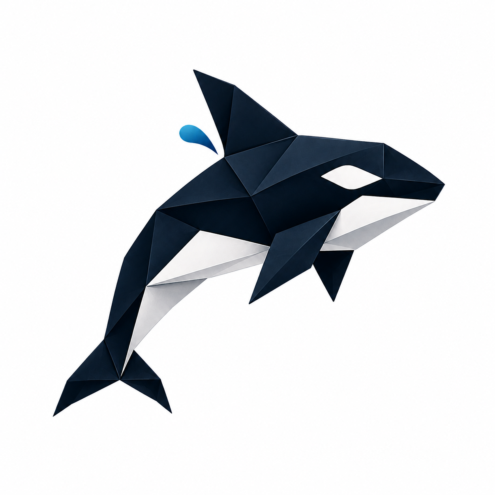

# OP-orca

<p align="center">
  
</p>

<h1 align="center">OP-orca</h1>

<p align="center">
<b>Open Modular AI Orchestration</b><br>
A lightweight AI workspace for local-first inference, multi-agent collaboration, vector memory, and recursive project automation.
</p>

<p align="center">


</p>

---

## Why OP-orca?

Today's AI landscape is fragmented.

One application runs local models.
Another manages cloud APIs.
A third handles vector databases.
A fourth coordinates agents.
A fifth manages prompts.
A sixth becomes your project manager.

**OP-orca unifies these into one cohesive workspace.**

Instead of building around a single language model, OP-orca builds around **projects**.

Projects become living workspaces capable of remembering, reasoning, collaborating, and recursively improving themselves.

Whether you're writing documentation, conducting research, engineering software, managing knowledge, or orchestrating autonomous workflows, OP-orca provides a single lightweight environment where everything works together.

No subscriptions.

No mandatory cloud services.

No vendor lock-in.

Just modular AI.

---

# Table of Contents

- Features
- Architecture
- Philosophy
- Directory Structure
- Quick Start
- Configuration
- Model Routing
- batch~string
- Streams
- Roadmap
- Contributing
- License

---

# Features

## Local-First

Runs completely offline using Ollama.

No API key required.

---

## Zero-Cost Baseline

Supports completely free providers including

- Ollama
- OpenRouter Free Tier
- Hugging Face Serverless

Upgrade to premium providers only when desired.

---

## Hugging Face–Inspired Model Browser

Rather than forcing users to remember model names, OP-orca organizes models by capability.

Filter models by

- ⚡ Speed
- ⭐ Community Rating
- 💲 Cost
- 🧠 Reasoning Depth
- 🖥 Context Window
- 🔒 Local vs Cloud
- 🏷 Provider

Example

```
Speed
★★★★★

Reasoning
★★★★☆

Cost
FREE

Provider
Ollama
```

---

## Secret Store

Encrypted local configuration for

- API Keys
- Tokens
- OAuth Credentials
- Local Settings

Secrets never leave your machine.

---

## Recall Boxes

Persistent semantic memory.

Supports

- ChromaDB
- LanceDB

Future

- SQLite Vector
- pgvector
- Milvus

Each Recall Box becomes its own searchable knowledge base.

---

## Offices

Dedicated AI workspaces.

Each Office contains

- Custom System Prompt
- Dedicated Memory
- Model Preference
- Tool Set
- Project Context

Examples

```
Writing Office

Research Office

Development Office

Business Office

Marketing Office

Legal Office
```

---

## Teams

Sequential collaboration between specialized models.

Example

```
Researcher

↓

Writer

↓

Reviewer

↓

Editor

↓

Formatter
```

Each stage can use a different model.

---

## Agentic Swarms

Parallel asynchronous execution.

Instead of sequential collaboration

```
Research A

Research B

Research C

Research D
```

execute simultaneously before merging into one result.

Ideal for

- Coding
- Large Research
- Literature Review
- Brainstorming
- Evaluation
- Multi-perspective Analysis

---

## batch~string

The orchestration engine.

batch~string connects

- Models
- Recall Boxes
- Offices
- Teams
- Swarms
- Streams

into reusable execution graphs.

Think of it as visual programming for AI.

---

## Streams

Recursive project automation.

Rather than asking isolated questions, Streams continuously improve work through iterative loops.

```
Search

↓

Build

↓

Evaluate

↓

Improve

↓

Repeat
```

Every iteration becomes smarter through accumulated project memory.

---

# Architecture

```text
                                       +--------------------------------------+
                                       |              OP-orca UI              |
                                       |      Minimalist Local Dashboard      |
                                       +------------------+-------------------+
                                                          |
                                                          v
                                     +----------------------------------------+
                                     |         LiteLLM Routing Layer          |
                                     | Speed | Rating | Cost | Depth | Local  |
                                     +------------------+---------------------+
                                                        |
                 +--------------------------------------+------------------------------------+
                 |                                                                           |
                 v                                                                           v
     +-------------------------------+                                   +-------------------------------+
     |        Local Providers        |                                   |      Cloud Providers          |
     |                               |                                   |                               |
     |  Ollama                       |                                   | OpenRouter                   |
     |  llama.cpp                    |                                   | Hugging Face                |
     |  vLLM                         |                                   | Anthropic                  |
     +---------------+---------------+                                   +---------------+-------------+
                     |                                                                   |
                     +------------------------------+------------------------------------+
                                                    |
                                                    v
                             +------------------------------------------------------+
                             |              batch~string Runtime                    |
                             +------------------------------------------------------+
                             | Recall Boxes                                         |
                             | Offices                                              |
                             | Teams                                                |
                             | Agentic Swarms                                       |
                             | Streams                                              |
                             +------------------------------------------------------+
                                                    |
                                                    v
                               +----------------------------------------------+
                               |            Project Workspace                 |
                               | Docs • Code • Memory • Tasks • Assets       |
                               +----------------------------------------------+
```

---

# Philosophy

Traditional AI applications answer questions.

OP-orca completes projects.

Everything revolves around persistent workspaces rather than isolated conversations.

Each workspace continuously grows through

- knowledge
- documents
- memories
- agents
- workflows
- evaluations

Projects become increasingly intelligent over time.

---

# Directory Structure

```text
OP-orca/
│
├── docker-compose.yml
├── README.md
├── LICENSE
├── .env.example
│
├── config/
│   ├── litellm-config.yaml
│   ├── models.json
│   └── providers.json
│
├── docs/
│   └── assets/
│       └── op-orca-logo.png
│
├── memory/
│   └── recall_boxes/
│
├── offices/
│
├── streams/
│   ├── templates/
│   └── active/
│
├── batch_string/
│
├── dashboard/
│
├── backend/
│
├── frontend/
│
└── docker/
```

---

# Quick Start

## Prerequisites

- Docker Desktop
- Git

Optional

- Ollama

---

## Clone

```bash
git clone https://github.com/your-username/OP-orca.git

cd OP-orca
```

---

## Configure

```bash
cp .env.example .env
```

No paid API keys are required.

---

## Launch

```bash
docker compose up -d
```

---

## Open Dashboard

```
http://localhost:3000
```

---

# Configuration

Primary configuration files

```
config/

litellm-config.yaml

models.json

providers.json
```

These files define

- Providers
- Routing Rules
- Model Profiles
- Cost Preferences
- Defaults

---

# Default Routing Profiles

| Alias | Purpose | Provider |
|--------|----------|----------|
| op-orca/free-fast | Everyday chat | Ollama (Qwen2.5) |
| op-orca/free-depth | Deep reasoning | DeepSeek R1 |
| op-orca/cloud-free | Free cloud inference | OpenRouter |
| op-orca/high-context | Long documents | Gemini Flash |
| op-orca/top-rating | Premium reasoning | Claude Sonnet |

---

# Example Stream

```yaml
stream_id: market-research

model_preference: op-orca/free-depth

loop_limit: 5

workflow:

  - step: search

    source:
      recall_box(local_docs)
      web_search()

  - step: build

    harness:
      team(researcher, writer)

  - step: evaluate

    criterion:
      factual_consistency

  - step: improve
```

---

# Future Roadmap

## Phase 1

- Dashboard
- LiteLLM Integration
- Ollama
- Recall Boxes
- Teams

---

## Phase 2

- Swarms
- Visual Workflow Builder
- Office Marketplace
- Shared Memories
- Multi-user Projects

---

## Phase 3

- MCP Integration
- Plugin Marketplace
- Distributed Swarms
- Autonomous Long-running Projects
- Enterprise Deployment

---

# Contributing

Contributions are welcome.

Areas of interest include

- Dashboard UI
- Routing Profiles
- Model Benchmarks
- Stream Templates
- Office Templates
- Documentation
- Integrations
- Testing

Fork the repository.

Create a feature branch.

Submit a Pull Request.

---

# License

Distributed under the MIT License.

See **LICENSE** for additional information.

---

# Vision

OP-orca is designed around a simple principle:

> Artificial intelligence should not replace human creativity.

It should amplify it.

The goal is to build an orchestration platform that is

- modular
- transparent
- local-first
- provider-agnostic
- open source
- infinitely extensible

One interface.

Any model.

Any provider.

Any workflow.

**Build once. Orchestrate everything.**
